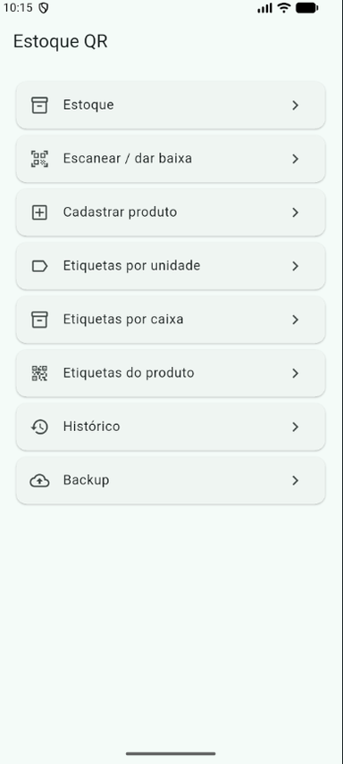
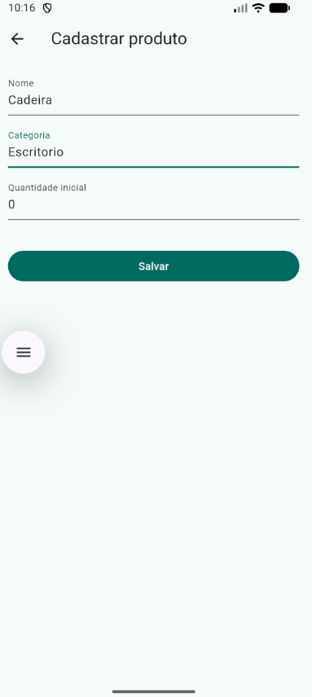
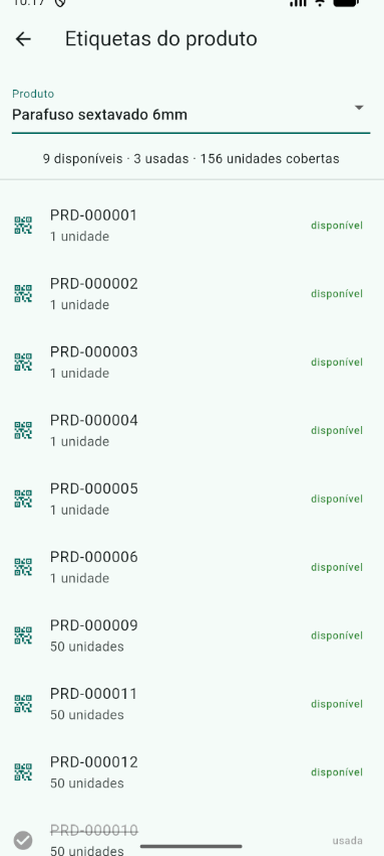
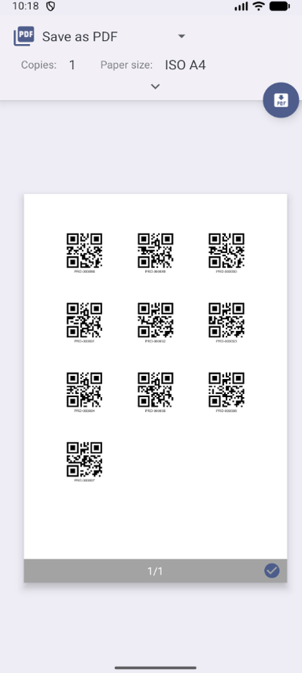
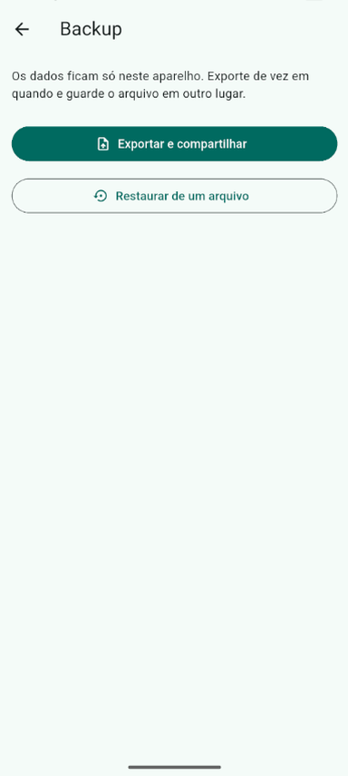

# Estoque QR

Controle de estoque para celular, com etiquetas QR. Você cadastra o produto,
imprime as etiquetas, cola nos itens e dá baixa bipando com a câmera.

Funciona **100% offline** — os dados ficam no aparelho, sem servidor e sem
conta. O backup é um arquivo JSON que você exporta e guarda onde quiser.

## Como funciona

1. **Cadastra o produto** com a quantidade inicial
2. **Gera etiquetas** — por unidade (cada QR vale 1) ou por caixa (cada QR vale N)
3. **Imprime** a folha em PDF e cola nos itens
4. **Bipa** a etiqueta na saída: o estoque cai sozinho, sem digitar nada
5. **Histórico** mostra tudo que entrou e saiu

Cada etiqueta vale **uma baixa só**. Bipar de novo é recusado — é o que impede
descontar duas vezes o mesmo item.

## Telas

| | | |
|---|---|---|
|  |  |  |
| **Menu** — tudo em um nível só, sem gaveta nem abas. | **Cadastro** — nome, categoria e quantidade inicial. Só isso. | **Etiquetas do produto** — as usadas ficam riscadas; as disponíveis, em verde. |

| | |
|---|---|
|  |  |
| **Folha de etiquetas** — vai direto para a impressão do Android, ou salva em PDF. | **Backup** — exporta um JSON e abre o compartilhamento do sistema. |

Repare no print das etiquetas: convivem códigos de **1 unidade** e de **50
unidades** no mesmo produto. A etiqueta de caixa dá baixa de 50 num bipe só —
quem decide a quantidade é a etiqueta, não quem escaneia.

---

## Rodar em outra máquina

### O que precisa

| | Versão | Observação |
|---|---|---|
| Flutter | 3.24+ | traz o Dart junto |
| Android SDK | API 30+ | vem com o Android Studio |
| JDK | 17 ou 21 | o Gradle 8.13 aceita os dois |

Confira com `flutter doctor` antes de continuar. Ele aponta o que falta.

### Instalar

```bash
git clone git@github.com:benhuk/armazenar-qr.git
cd armazenar-qr

flutter pub get
flutter pub run build_runner build --force-jit
```

O segundo comando **é obrigatório**: ele gera `lib/data/database.g.dart`, que
não está no repositório. Sem ele o projeto nem compila.

> **Por que `flutter pub run` e não `dart run`?** O `dart` sozinho não enxerga
> o SDK do Flutter e falha com *"the Flutter SDK is not available"*.
>
> **Por que `--force-jit`?** O pacote `sqlite3` usa *build hooks*
> (`hook/build.dart`), e a compilação AOT do build_runner não suporta isso —
> o erro é *"'dart compile' does not support build hooks"*. O `--force-jit`
> desvia disso. Sem essa flag, o codegen não roda.

### Rodar

```bash
flutter devices                 # lista emuladores e aparelhos conectados
flutter run -d <id-do-device>
```

Para o emulador: `flutter emulators` lista, `flutter emulators --launch <id>`
inicia.

### Testes

```bash
flutter test        # 100 testes, todos sem depender de banco em disco
dart analyze
```

---

## Instalar no celular

### Pelo cabo, com o PC

Ative **Opções do desenvolvedor** → **Depuração USB** no aparelho, conecte e:

```bash
flutter run -d <id-do-device>
```

### Gerando um APK, sem precisar do PC depois

```bash
flutter build apk --release
```

O arquivo sai em `build/app/outputs/flutter-apk/app-release.apk`. Passe para o
celular (cabo, Drive, WhatsApp) e abra para instalar — o Android vai pedir
autorização para instalar de fonte desconhecida.

> Sem uma chave de assinatura configurada, o Flutter assina com a chave de
> depuração. Serve para uso pessoal, mas **não** serve para publicar na Play
> Store. Para isso é preciso gerar uma keystore e criar `android/key.properties`
> — que **não deve** ir para o GitHub.

### Permissão de câmera

Já está declarada no `AndroidManifest.xml`. O app pede autorização na primeira
vez que você abre a tela de escanear.

---

## Problemas conhecidos

**`Could not determine java version from '21.0.8'`**
O wrapper do Gradle está velho demais para o seu JDK. Confira
`android/gradle/wrapper/gradle-wrapper.properties` — tem que apontar para
`gradle-8.13-bin.zip` ou mais novo. Algumas distribuições do Flutter (o pacote
AUR, por exemplo) geram esse arquivo apontando para o Gradle 2.14.1, de 2015.

**`version solving failed` no `flutter pub get`**
Seu Dart é mais antigo que o exigido por alguma dependência. O `pubspec.yaml`
já usa faixas largas (`build_runner: ^2.4.0`, `drift_dev: ^2.20.0`) para
funcionar a partir do Dart 3.10. Se ainda assim falhar, `flutter upgrade`.

**O app abre mas o estoque não aparece**
Provavelmente o `build_runner` não rodou. Repita o passo de instalação.

---

## O que fica no repositório

Tudo que está versionado hoje é o que deve ir para o GitHub. Em resumo:

```
armazenar-qr/
├── lib/                     # código
├── test/                    # 100 testes
├── android/                 # projeto Android (sem os artefatos de build)
└── pubspec.yaml
```

### O que NÃO subir

Já está tudo no `.gitignore`, mas vale saber o porquê:

| Caminho | Motivo |
|---|---|
| `**/build/`, `**/.dart_tool/` | artefatos de compilação, pesados e regeneráveis |
| `*.g.dart` | gerado pelo build_runner a partir do código |
| `android/local.properties` | tem o caminho do SDK **da sua máquina** |
| `android/.gradle/` | cache do Gradle |
| `android/key.properties`, `*.jks` | **chave de assinatura — nunca suba** |

Este projeto não tem chave de API nem senha: é offline por natureza. Se um dia
adicionar integração com nuvem, a credencial não pode ir junto no código.

### Sobre `*.g.dart`

Está ignorado porque é gerado. A contrapartida é que **quem clonar precisa
rodar o `build_runner`** antes de compilar. Se preferir que o clone funcione
direto, remova `*.g.dart` do `.gitignore` e comita o arquivo gerado — a troca é
ter diffs grandes e ruidosos a cada mudança de schema.

---

## Estrutura do código

```
lib/
├── main.dart                # menu principal
├── data/
│   ├── database.dart        # tabelas, exceções, migrações (schema v4)
│   ├── produtos_dao.dart    # cadastro e busca
│   ├── etiquetas_dao.dart   # geração e resumo
│   ├── movimentacoes_dao.dart # entrada, saída e a baixa do scanner
│   ├── backup_dao.dart      # restauração integral
│   └── backup_service.dart  # exportar/importar JSON
└── screens/                 # uma tela por arquivo
```

Os métodos ficam em `extension` por assunto, e o `database.dart` reexporta
todos — então `import 'database.dart'` traz a API inteira, e cada arquivo fica
pequeno.

O banco tem migração versionada (`schemaVersion` 4). Ao mudar o schema, suba a
versão e adicione o passo em `MigrationStrategy` — há testes cobrindo a
migração em `test/migracao_test.dart`, inclusive o caminho a partir da v1.
